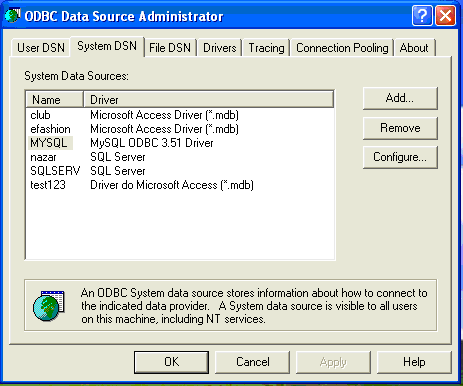

### [Documentation Home](/docs) 

<i class="fa fa-book" aria-hidden="true"></i>

# Installation Guide for v6.2.2

[http://sourceforge.net/projects/dataquality](http://sourceforge.net/projects/dataquality/)

## Prerequisite Setup 

### Hardware Requirement

Windows, Solaris, Linux (HP and AIX not tested but it should work fine as Java is portable across platforms). Any platform that supports JDK/JRE 1.7 or higher should work fine.

For UNIX machines “telnet” session to server will not work. CDE (common desktop environment), XManager (eXeed, hummingbirds etc) or any Desktop based login to server (Xterm) is needed to start the graphics. 

Freely available XManager software is available for UNIX. You can download one if still you have not any XManager. Most of companies have XManager bought or downloaded to connect to UNIX servers from window desktops.

Typing following on command line for UNIX 

`xterm` 

should launch Xwindow  on unix.

### Software requirement:
JDK / JRE 1.7.0_07 or above.

Type `java –version` on command line to see what java you have.

```bash
java –version
java version "1.7.0_07"
Java(TM) SE Runtime Environment (build 1.7.0_07-b11)
Java HotSpot(TM) Client VM (build 23.3-b10, mixed mode, sharing)
```

### Database Certified:

MS Access, SQL Server, MySQL, Oracle, Db2,  Postgres, HIVE Thrift , Informix, Splice DB

## Database Prerequisite:

Window User should know how to create DSN or Use existing DSN for MS Access, SQL Server, MySQL, and Oracle  on Windows. ODBC driver for MySQL can be downloaded from [http://www.mysql.com](http://www.mysql.com) (if you do not have ODBC driver for MySQL on Windows) MySQL ODBC driver does not come by default with Windows.

Oracle User should add the service name in `tnsnames.ora` file.

On windows DSN can be created 

> Start > Control Panel > Administrative Tools > Data Sources > System DSN

 

MySQL, MS Access and SQL Server and Oracle is supported via `JDBC:ODBC` bridge. 

MySQL, MS Access and SQL Server user can do “Test connection” from ODBC Data Source Administrator Panel. Oracle user can do following on command line 

> tnsping <SERVICE_NAME> 
to check the connection.

Oracle, MySql, Postgres, DB2 and Hive are also supported via JDBC on both UNIX and Windows.

`<ORACLE_HOME>/lib` should be in LIBPATH (for AIX), LD_LIBRARY_PATH (for Solaris) or SHLIBPATH (for HP) for UNIX user. For Windows user it will be in PATH by default if Oracle is installed.

Technically speaking any data source that supports JDBC can use this profiler.

__Preferable one should use JDBC driver wherever possible.__

## Product Installation

Create a folder or Directory

Unzip or `jar –xvf  ProfilerV<version>.zip` in the folder you want to install.

### WINDOWS

```bash
runprofiler.bat  or
runprofiler.bat  “configFile.txt”  (if Database  parameters are set in configFile.txt)
```

### UNIX

```bash
runprofiler.sh  or  
runprofiler.sh  “configFile.txt”  (if Database  parameters are set in configFile.txt)
```

## Uninstallation

Remove the folder.

__Enjoy!!__