### [Documentation Home](/docs) 

#    OSDQ User Guide v6.2.2

## Table of Content

1. [Introduction](#introduction)
2. [Component](#component)
3. [MainFrame](#mainframe)
    * [File Menu Information](#filemenuinformation)
    * [DB Info Menu (Metadata Information)](#dbinfomenu)
    * [Tools](#tools)
        * [SQL Interface](#sqlinterface)
        * [Import File](#importfile)
            * Import File (File Table Display) > Options
            * Import File (File Table Display) > Column
            * Import File (File Table Display) > Analytics
        * [Create Format](#createformat)
        * [Tools Search DB](#searchdb)
    * [Data Quality](#dataquality)
6. [Information Pane](#informationpane)
    * Information panel for column
8. [Analysis Pane](#analysis)
    * [Binning](#binning)
    * [Clustering](#clustering)
    * [Number Profiler](#numberprofiler)
    * [Statistical Analysis](#statisticalanalysis)
    * [String Analysis](#stringanalysis)
    * [Edit Mode Show Record](#editmodeshowrecord)

## Introduction

Aggregate Profiler  Data Quality and Data Profiling software that is certified against RDBMS (oracle, mysql, Db2,MS Access, Postgres and SQL Server) Flat File, XML and XLS file, and Hive ( Hadoop) formats for analysis. This software can be used for profiling of data, quality check (and correction), and analysis of data (statistical analysis, charts). You can use this software to check cardinality between different tables within one data source. All the above mention formats are interchangeable – like from database query, XLS can be generated or an XML file can be mapped to XLS.

This software can also be used for random generation of data, populating database values, looking into database Metadata, fetching and storing data from/to database.

** Frame, Window, Dialog box, Pane have been used interchangeably. They represent a container interface which has options to do other activities.
** Words in “” will exactly match the words on graphical user interface.

## Component:

The most important component is ReportTable will looks like [fig 1.0](#fig1) if editable or like [fig 14.0](#fig14) if not editable. If RepotTable is mapped to dataset from Database it will look like fig 21.0 .This is a core component which stores data in tabular format. It is has two parts – table part and top header part. 
It supports cuts and paste from flat file, clip board, xls – giving great interoperability with other desktop tools.

ReportTable “Menu” option will give a list of options that can be applied on tabular data. “Select All” and “DeSelect All” will select (Yellow color) or deselect (if some data is selected), all the tabular data.
“Record Count” and “Selected Count” will give total rows & columns’ count or selected rows and columns’’ counts.
“Regex Seach” will allow regular expression enabled search of tabular data.
“Analyse Selected” will do number analysis (if data type is Number) or string analysis (default) of the selected rows of the selected columns. If there are more than one columns selected, it will take the first column. If nothing is selected, no analysis will be done.

“Horizontal Scrollbar” if selected will create a horizontal scroll bar at the bottom of tabular data. Then each column will become expandable. This option is for tables which has more columns, so that all columns are readable and can be expanded if needed.

Tabular data can be printed or saved as XML, XLS or flat file (CSV) by clicking “Save as” button.

By clicking column header, user can sort columns (with row integrity intact – complete row will move not only the column data). If <Ctrl> is pressed while clicking column header, data can sorted by multiple columns.

This options can be used to find duplicated values or sorted by multiple orders – like first by state, then ( keep the <Ctrl> down) then by City. If the ReportTable is editable, row header down triangle  will appear. After selecting row(s), right clicking on down triangle  will show a popup menu like [fig 1.0](#fig1)

<a name="fig1"/>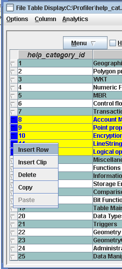

Fig 1.0 Editable ReportTable

## MainFrame

On successful installation and connection to database you should be able to see ConsoleFrame and MainFrame like the following [fig 2.0](#fig2) and [fig 3.0](#fig3). If you are not able to see or see some errors, please look into “Installation Guide”. It indicates connection or setup error.
 
<a name="fig2"/>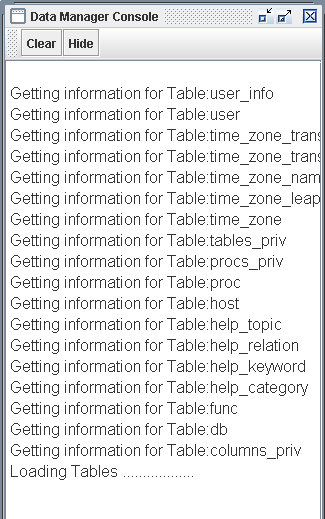 

ConsoleFrame Fig 2.0

MainFrame is the main window which has “File”, ”DB Info”, “Tools” and “Data Quality” as top order menus.
In the left panel, table and column information will be shown in tree format. Right Panel (“Information”) will have information about license and support. On bottom bar, there is information about total table count and database user. This panel will be shown again, if user clicks the root element of tree (DataSource).

<a name="fig3"/>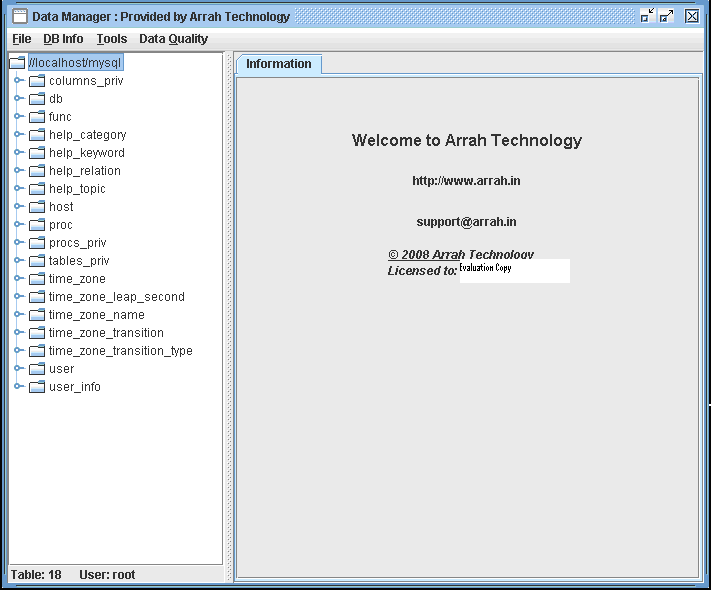 

MainFrame Fig 3.0

### __MainFrame > File Menu Information__

File > Open will prompt user to open a file in `*.atd` format. These are the files generated by Number Analysis, Statistical Analysis or String Analysis “Save Report” buttons or File > Save Menu.  There are java serialized files which are stored in binary mode.

File> Show Console will display the ConsoleFrame if it is not already displayed.

### __MainFrame > DB Info Menu (Metadata Information)__

MainFrame > DB Info menu will open up like fig 4.0

Submenu under “DB Info” are used to give different metadata information about database like version information, compliance support, maximum supported capacity, date, string, numeric and general functions supported by database, SQL types supported by database, Objects like Catalogue, schema, Stored Procedures, Parameters, Index present in database.
 
<a name="fig4"/>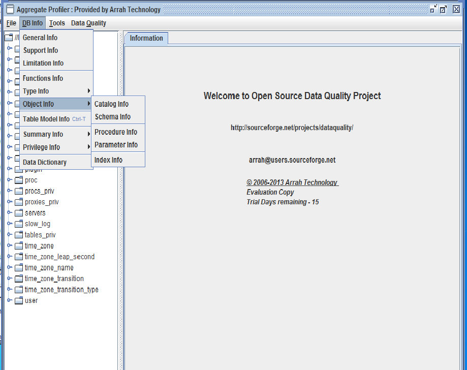 

DB Info Menu – Fig 4.0

DB Info > Table Model Info will open new frame which will have information about tables with no primary key, tables with primary keys, tables with primary key and foreign key and their relationship (like ER diagram). User can save the relationship as image, print the relationship, found and count the table in all 3 categories.

__Color Legend__

* TableName  –  Black
* PrimaryKey –  Red
* ForeignKey –  Blue 

DB Info > Summary Info Table MetaData Info (DB MetaData Info) will give information about table metadata or all the tables’ metadata information.
DB Info  Summary Info  Data Info will give the aggregate information of all tables. Individual information about table can be found from “Summary Data” link from “Information” Panel of the selected table.

DB Info > Privilege Info will give information about user privileges, if s/he has right to check privilege.
DB Info > Data Dictionary will create data dictionary in pdf format.
DB Info > Search will give options to fuzzy search about table name, column name and data type.

### __MainFrame > Tools__

They are not directly responsible for analysis but provide framework that will help profiling and analysis.

### Tools > SQL Interface

ToolsSQL Interface will open a window with text area where SQL can by typed. “Check SQL” will not commit the SQL but check the well formedness of SQL. “Run SQL” will commit the SQL. “Time Taken” label will tell millisecond taken to run the SQL query. Output will be generated in ReportTable.

SQL Interface  Query will show five most recent queries run. User can select those if rerunning is required.

Other options are 
SQL Interface  Query  Open, Save as, Delete. It will allow used to save, open or delete a query, identified by a name. These <name, query> information is stored in the file “storedSQL”. If the file it not there, it will be generated. It is a good option to save complex queries for future reference. Name will be identifier of the Query.

SQL Interface  Option  Enter as Button Click will give option to select which options (“Check SQL” or “Run SQL” or none) should be run when user press <enter> inside text area.

SQL Interface  Option Default Format will allow SQL Object to map to Java Object. If not selected every thing will be mapped to String.
Tools Create Table:
This feature will create a table on the DataStore you are connected. You need to refresh it to see new table.
Tools  Open File:
This is a very important option which can upload flat file (with various kinds of tokens, delimiters and separators); xml file and xls file into data profiler system and can apply various analyses and profiling on file data.  We used two other open source jar files (saxon.jar and jxl.jar) to load and save files from/to xml and xls formats. If user is loading a flat file, s/he should see a dialog box like [fig. 5.0](#fig5).  XLS and XML type of file will not display parsing option dialog. They use DTD schema file for XML to apply parsing logic.

User can choose either “Field Separator” or “Width Separator”. “Field Separator” should be chosen when column separator is Character or String like white space, comma ( commonly called CSV files ) or some other string like ###,;. If you are choosing “Advance Options” radio button, you should click “Advance Options” button to put input delimiter for each column.

“Width Separator” should be chosen if the columns are of fixed width – like 10 bytes. If column separators are of variable width, “Advance Options” radio button should be checked and then click on “Advance Options” buttons to provide input for all columns.

“File Information” block has two options – “Lenient Parsing” and “First Row Column Name”. If “Lenient Parsing” is checked, if some rows have more or less numbers of columns than the first row, it will be displayed otherwise rows which column number does not match will not be displayed.
“First Row Column Name” – as name explains if checked will treat first readable row (after skipping for comments and the number in the “Skip Rows” in “File Optional Information” block) as column name using the same logic for parsing.

“File Optional Information” block has 3 checkboxes that will take number input if the checkbox is selected.
“Comment String” – this character will be treated as comment char. If line is starting with that character, it will be skipped.
“Skip Rows” – The number is in “Skip Rows” textbox will tell how many rows to be skipped from the beginning of file. First those rows will be skipped then Comment character lines will be skipped.
“Preview Rows” – will tell you how many rows to be displayed in “Preview” mode. Default value is 15.

“Raw Value” button will reload the raw file into preview table. It is like loading the file first time.

“Preview” button will show how the file will look like after having all the format and conditions applied. 
“OK” button will load the file.

<a name="fig5"/>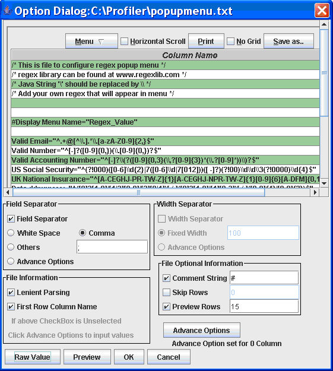 

Import File Fig 5.0

“Advance Options” button is used to enter variable (for every column) values. It can be used to enter column name, regular expression based column separator or column width.

<a name="fig6"/>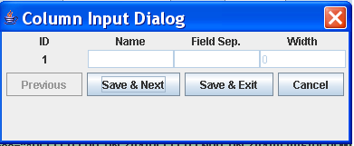 

Advance Option Fig 6.0

If “First Row Column Name” or “Advance Options” from “Field Separator” or “Width Separator” is chosen, respective fields in “Column Input Dialog” will become editable. “Field Sep.” also takes regular expression.

If you want to create n numbers of columns, then you will need to enter n column names but “Field Sep.” or “Width” should be n-1. For Example if you need 2 columns, you need to put “Name” for Id 1 and 2 but “Field Sep.” or “Width” will be only one. Based on this separator, two columns will be created.

Col1 <Separator> Col2 <Separator>Col3

“Advance Options” information sit in memory so if new file is loaded, it will be lost. “Advance option set for n column” will give the information about advance option set for input columns.

When a flat, XML or XLS file is uploaded following Frame [Fig 7.0](#fig7) will appear. Noteworthy is, all the columns loaded are of type String. If you want to change it to Number or Date type use OptionsFormat 

<a name="fig7"/>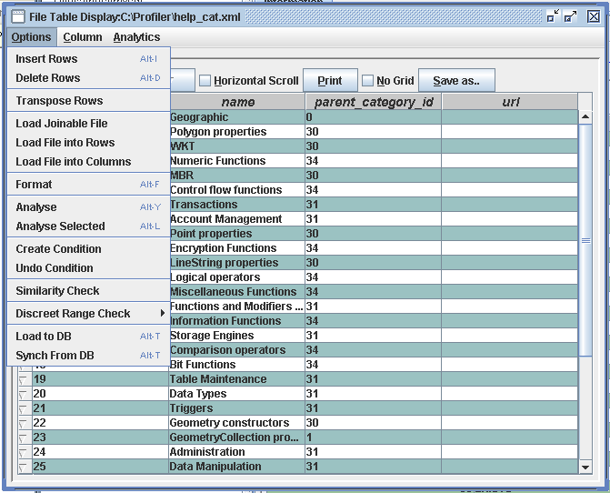 

Import File  Option Fig 7.0

“File Table Display” Pane has multiple options to analyze file data and create the data that is needed for various analyses. It has also options to fetch data from database and put data back to database.
Import File (File Table Display) Options:

OptionsInsert Rows will inset n number of rows from the index given. Index 0 means it will inset at the beginning of rows. Index 0 represent first row.
OptionsDelete Rows will delete n number of rows from the given index.
If “Last Row” radio button is selected it will add or delete from end of table.
Options Transpose Rows will change rows into columns. Column names will be automatically generated. If you wan to change column name you can choose ColumnRename Column
OptionsLoad Joinable File will prompt to choose another file (Flat File, XLS or XML) and prompt to choose joinable columns from previous file (already displayed) and newly loaded file. It will create a 1:1 left outer join of two files based on the columns chosen. Previously loaded table is left table and newly loaded table is right table from join perspective.

If there is m: m relationship between two files the last record of the right table matching the join will replace previous record. If the are multiple match on left side (duplicate values in previous table), only first record will be updated with join table. Other subsequent duplicate records will be ignored.

If there are m and n columns in left table and right table, respectively, after the completion of this activity, there will be m+n-1 columns.

OptionsLoad File into Rows will increase row count but column count will be same. If new file has more or less column, either it will be padded with no values or truncated. It will have m columns.
OptionLoad File into Columns will increase the columns count to m+n.

OptionsFormat will prompt to choose column that you need to format. Then it will display a dialog like [Fig 8.0](#fig8)

<a name="fig8"/>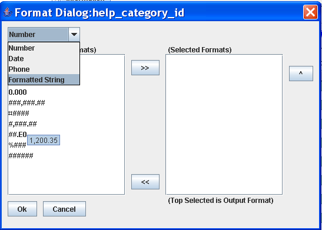 

Format Dialog Fig 8.0

Use can choose Number, Date, Phone or Formatted String format. Formats associated with these types will appear in the left list box. These are the formats created by MainFrameToolsCreate Format.
User can choose multiple formats from left list box and put into right list box.
Data (Format) of the column will be matched for right list box format. If it matches any of the right list formats, it will be converted to the type (Number, Date, Phone, Formatted String) and will be displayed like the top format of right list box.
Take the following example in [Fig 9.0](#fig9)

<a name="fig9"/>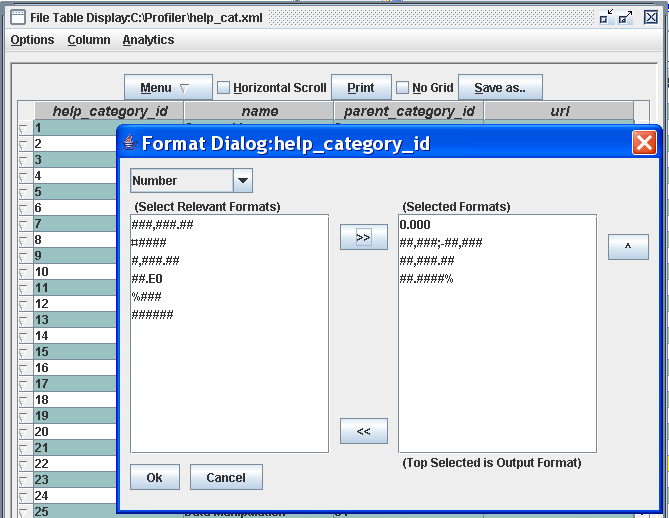 

Format Dialog Selection Fig 9.0

Here column ‘help_category_id’ is chosen for Number Formatting. So if the formats of ‘help_category_id’ are matched to any of the four formats of right list box it will be converted to number.  Since the first selected format is 0.000, display of Numbers will be of the format 0.000 like 1.000, 2.000, 34.000 etc.
Formatting is a two step process – first it will format String to the Type selected, based on group of formats selected and then will format the display of the data type. Once the column is formatted, edit will allow entering data in output format.
Format is useful if you receive data in different format and want to change to one format or want to discard some of the formats.
Once formatted Number will appear Dark Red, Date will appear Dark Magenta and String will appear Dark blue.

OptionAnalyse will prompt user to choose the column to analyze. If is a number type it will give statistical analysis, cluster charting for the column.
Option  Analyse Selected will do it for the first selected column. It is same as choosing from ReportTableMenuAnalyse Selected. 

OptionsCreate Condition will display Query Dialog very similar to Query Panel displayed if you click on icon  
This option will allow user to select conditions based on the columns and then “Validate”. If it is a valid filter (condition) “Validate” will return number of rows that passed the rule. Then user can choose “Apply” to implement it. If you choose “Create Condition” again, it will apply rules on the data subset, already displayed. 
Option  Undo Condition will undo all the filters and original data table will return. To reemphasis, it will return the original table when no filters were applied, not the previous table without last applied filter.

Options  Similarity Check will check similar records. Aggregate Profiler uses Lucene open source for doing fuzzy logic based similarity check. “Similarity Check” will open following Dialog [Fig 10.0](#fig10)

<a name="fig10"/>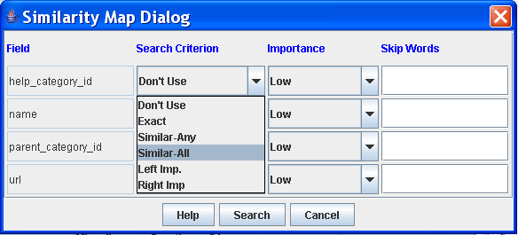 

Similarity Dialog Fig 10.0

“Field” column will display columns of file. The final search will be done using “AND” logic for all “Search Criterion” of all selected columns. So if user does not want to use some columns for similarity check, choose “Don’t Use” as “Search Criterion”.

“Search Criterion” has following options.
“Don’t Use” – This column will not be used for similarity check.
“Exact” – Only look for exact matches for this column data.
	Match – “abcdef ghi” and “ABCDef gHI”
	No Match – “abcde fg” and “abcd efg”
“Similar-Any” – If any word is similar for this column data.
	Match – “abcdef ghi” and “ABCD cbvsddd”
	No Match – “sdlkf  fg” and “abcd ”
“Similar-All” – Only if all words are similar for this column data.
	Match – “abcdef ghijk” and “bcdfe hij”
	No Match – “abcdef ghi” and “bcdfe  mnvvcck”
“Left Imp.” – If left 4 characters are same for this column data.
Match – “abcdef ghijk” and “abcdmcncnc”
	No Match – “abcd ghi” and “bcdfe  mnvvcck”
“Right Imp.” – If right 4 characters are same for this column data.
Match – “abcdef ghijk” and “xsee HIJK”
	No Match – “abcdef ghi” and “bcdfe  mnvvcck”

“Importance” field will allow user to choose weight for the column.
“Skip Words” is a comma separated field that will allow user to enter comma separated words that should be ignored for checks. Like, If user enter ‘Inc, Road, Corporation’ into “Skip Words” field these words will not be used for similarity check.

Options  Load to DB will load data from file to database. It will open a mapping pane where user can map file’s field to database’s column. It is user responsibility to map right data type field otherwise those field will not be loaded into database. – Like do not map String to Integer or vice versa.

User can save the mapping in XML file and in future can use the same XML file to do the automatic mapping. That will save time and pain to do mapping every time.

Options  Synch From DB will fetch data from database to file’s field. If database has less number of records than file’s row, extra records will be populated with NULL values. If database has more number of records only numbers matching with file’s rows will be fetched. 

Import File (File Table Display)  Column:

“File Table Display”  Column has options to add, delete, search, copy, paste, rename, Case Formatting, and  populate column data. These options will prompt to select the column on which above operations can be done.

“File Table Display”  Column  Populate Column has 4 options to populate columns. It is advisable to first populate the column then format, if needed. All options below can populate only subset of column. This functionality can be used to populate the column as per user distribution.

“Auto Incremental” – will populate the column starting from the chosen number.

“Expression Builder” – will open up following dialog [Fig 11.0](#fig11). Aggregate Profiler uses third party open source Jeval to build the expression. It is a useful option to generate new column’s data with the mathematical expression or just concatenating strings. Say user has ‘Sales’ data in one column and ‘Expense’ data in other column. user can create a new Column ‘Profit’ by choosing “Expression Builder” =  #{Sales} - #{Expense}

User can choose the fields by double clicking the columns from right list box. “#{“ will be prefixed and “}” will be post fixed. This is required for Jeval expression evaluation.  This value will appear on top left textbox. If fields should be treated as String, fields with prefix and postfix should be with “” – like “ Name is :”+”{#name}”

By Clicking “Parse” button, User can check whether expression is valid or not. If it is valid, the Value will appear next to “Value:” label on top left bar.

“OK” button will populate the column – row by row by using the same expression.

<a name="fig11"/>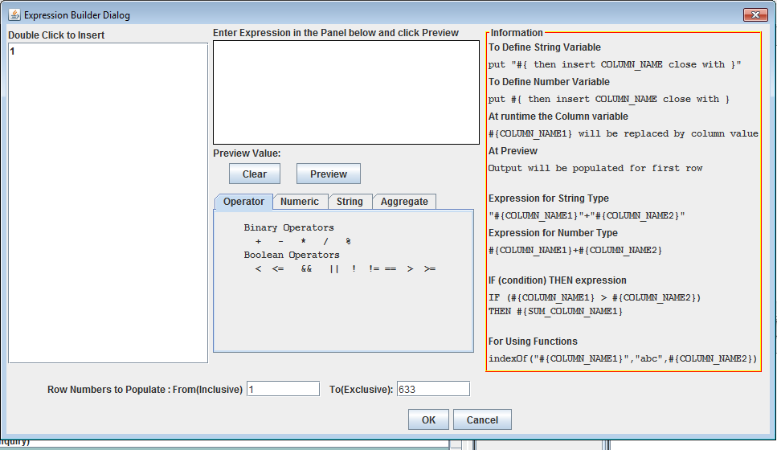

Expression Builder Fig 11.0

“Random Generation” – will generate random numbers, strings (in the chosen language), and dates with the selected filter. It is a useful option to generate large number of data for testing purposes. Also it can be used to randomly assign a value to a data.

“Data Explosion” will take input data in delimiter separated list and populate the list to fill the column by populating from the set of given numbers.

Data Grouping – Number and Date field have options to group the data in baskets. Like date / time can be grouped in month or year. Number 1-100 can be grouped into one basket.

“File Table Display”  Column  Mask Column will display a panel like figure 11.a where user can shuffle a record, shuffle the records across tables or mask the record. User can select the columns (from the list of referential integrity options) which records will move together while shuffling across the table.

<a name="fig11a"/>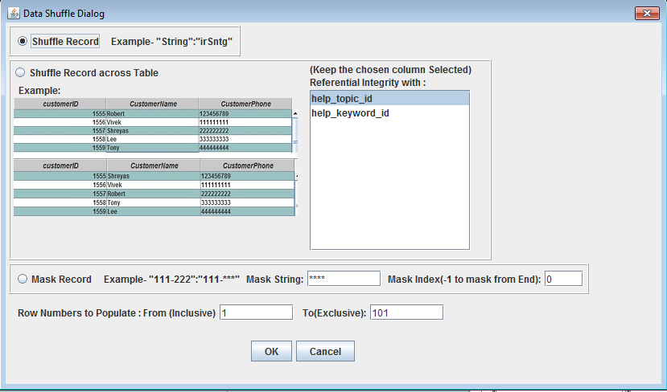

Mask Column Figure  11.a

### Import File (File Table Display) > Analytics:

“File Table Display” > Analytics has options of Line Chart, Bar Chart, Horizontal Bar Chart and Pie Chart. These “Analytics” options will allow user to choose “Chart Title”, Y-Axis Column (Measures) and X-Axis Column (Dimension).  If X-Axis is of Date Type, Combo Box will allow you choose granularity of time series – like Months, Quarters, and Year etc.

If Y-Axis column is Number Type, its values will be summed by X-Axis Groups. For any other data type Y-Axis values will be counted by X-Axis Groups. It will be like – 
 	SUM(Y-Axis) Group By X-Axis if Number Type
 	Else COUNT (Y-Axis) Group By X-Axis.
Right Click on Analytics will give the option to “Save as Image”.

### Tools > Create Format

MainframeTools Create Format is option to create Number, Date, Phone or String Format. These created formats are used by “Data Quality” options or “Import File” options to match with Formats. Once a data type is chosen, it will display a Format Dialog like [Fig 12.0](#fig12).

Central part of the Format Dialog will explain which characters can be used for format and what they represent.  User can create format by putting those Format Characters into the textbox labeled “Format:” Then a data example for that matching Format should be put in the textbox labeled “Example:” In the example – the format represents 3 Lowercase Character and 3 Uppercase Character. Example is “abcDEF”. When “Validate” is clicked it will match the data example with the format. In the above example, it matches (3 Lower case followed by 3 uppercase), then it will prompt user to save the format. Once it is saved it is available to “Data Quality” and “Import File”. Formats are saved into a file called “formatFile.atc”

<a name="fig12"/>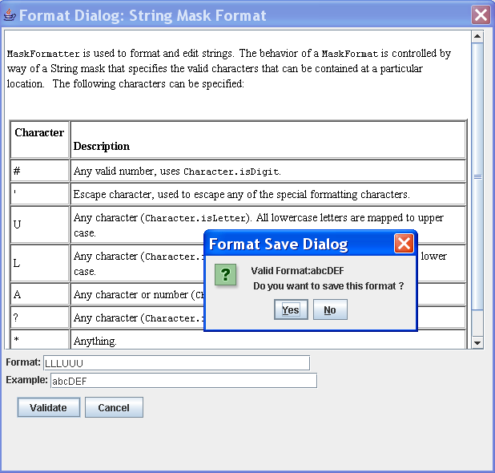

Format Builder Fig 12.0

__Tools > Create Regex__

This option will throw up a window that has already saved regex and input box to create new regex. Once user create and save new regex it will appear in search tool.

__Tools > Search DB__ 

MainFrameTools Search DB will search for the string against all tables using standard like query ‘%Search String%’.  It does not use fuzzy logic to do search. Output will be shown in tabular format that will have clickable “Count” column and “Table” column. “Count” column will have count of number; search string was matched in the table. By clicking the “Count” number, user can see all the rows of table in editable mode that matches the string. User than then do modification to the row values. 
 
__Tools > Search Table__

MainFrameTools Search Table will search for the string against the selected table and selected column using standard like query ‘%Search String%’.  It does not use fuzzy logic to do search.

__Tools > Similarity Search__

MainFrameTools  Similarity Search will search for the string against the selected table and selected column using fuzzy logic to do search.

__Tools > Record Match__

MainFrameTools  Record Match will ask for single or two files and based on the columns selected for those file(s), it will do fuzzy match of the records ( with ‘and’ clause). User can select the threshold for fuzzy match between 0.00 and 1.00 and select the Algorithm for match.
If two files are selected it will show all the columns of first file and all the columns of second file.

__Tools > Record Linkage__

MainFrameTools  Record Linkage will ask for two files and based on the columns selected for linking from  those files, it will do fuzzy linkage of the records ( with ‘and’ clause). User can select the threshold for fuzzy match between 0.00 and 1.00 and select the Algorithm for match. 
If two files are selected it will show all the non-linked columns of first file and then linked columns (common) of first and second file and then unlinked columns of second file.
Common Columns will be renamed as ‘Left Column-Right Column’ and linked data will be displayed as “Left Data-Right Data’.

__Tools >Record Merge__

MainFrameTools  Record Merge will ask for single or two files and based on the columns selected for merging from  those files, it will do fuzzy merge of the records ( with ‘and’ clause). User can select the threshold for fuzzy match between 0.00 and 1.00 and select the Algorithm for match. 
If two files are selected it will show all the non-linked columns of first file and then merged columns (common) of first and second file and then unlinked columns of second file.
User will have option of “Ignore, Take Any, Most Common, Sum, Count, Min, Max, Average” to be applied to non-linked columns. This option will be used for creating a golden copy.

### __MainFrame > Data Quality__

MainFrame > Data Quality has all important actions to check and correct Data Quality issues of database tables. It takes one table at a time to run data quality checks.
User can select table, columns and apply filters by clicking icon. If quality check is of multi column check, like “Duplicate, Similarity, Incomplete” all the selected columns will be used otherwise (like in case of Search & Replace, Formatted, Case Format, and Discreet Range) only the first selected column will be used.

“Duplicate” will find duplicate data in selected columns.
“Similarity” will use fuzzy logic to find similar words/data in selected columns. It is same as “Import File”Options Similarity Check. Only difference is, it will apply on database columns.

“Search & Replace” will take a file which has a format like “searchReplace.txt” file. It will search for the string that left side of equal to (=) sign in the file (this may be a regular expression) and replace with string that is inside double quote “” on the right side of equal to (=) sign.

“Incomplete”  AND looks for Column X is null AND Column Y  is null
“Incomplete”  OR will look for Column X is null  OR  Column Y  is null
“Formatted”Match will display the data that matched the format.
“Formatted”No Match will display the data that did not match the format.

“Case Format” will display the values that did not match the selected “Case Format” options of lower case, UPPER CASE, Title Case and Sentence case.

“Discreet Range”  Discreet Match will display if the values of the column matched discreet values, defined into the input textbox. User can choose Delimiter “Comma”, “New Line”, “White Space” or “Others”. If user is selecting Others, s/he can input delimiter value in the textbox.

“Discreet Range”  Discreet No Match will display if the data of the column did not match discreet values, defined into the selected file.

This option is useful if the values are discontinuous and not range bound. Like matching states’ ID abbreviations of USA (like CO, MO, NY etc). Keep the state abbreviation into a file and run discreet match to find which all data matched or did not match.

“Data Quality” options will find the data that meet or does not meet quality checks (depending on user selection) and open it in editable ReportTable. User can make changes to the editable column (generally the first column is editable all other columns are non editable) of result ReportTable and “Commit” to database or “Close” it. Closing will close the window without committing to database.

“Cross Column” validation will fuzzy search values of the primary chosen column in other columns.

“Cardinality” is a little different type of data quality check which is used to establish relationship between two columns (within same table or in two tables). This option will throw a window like Fig 13.0.  User can select Table A, Column X and Table B, Column Y to match cardinality or m: m relationship. Only column with same data type will be matched if they are not in same table – (then only they can be related. String can not have cardinality relationship with Number in another table). If they are in same table, any data type can be matched. User can choose what kind of cardinality check, s/he wants – 1:1, 1: m (more than one only), 1: m (including one), 1: n (one to n relationship).

“Analyse” button will find the values which matches and does not match the relationship.
Bar chart is showing how many data values of left table (Table A) is matching and not matching (null is not considered for this relationship so it is show separately) relationship. Same for right table (Table B)

Left Value in parenthesis denote Table A (Left table) and Right Value in parenthesis denote Table B (Right table). 
The way to read following example is - 36 records of column ‘help_category_id’ of Table A (help_category) has 1: m (including one) relationship with 36 records of column ‘name’ of Table B (help_categoty). There is not record on both side which does not have 1: m relationship. In other word, there is no ‘name’ without ‘help_category_id’ and at least one ‘name’ is associated with all ‘help_category_id’.

Clicking on “Table A Match”, “Table B No Match”, “Table B Match”, “Table B No Match” will display records of the clicked category.

<a name="fig13"/>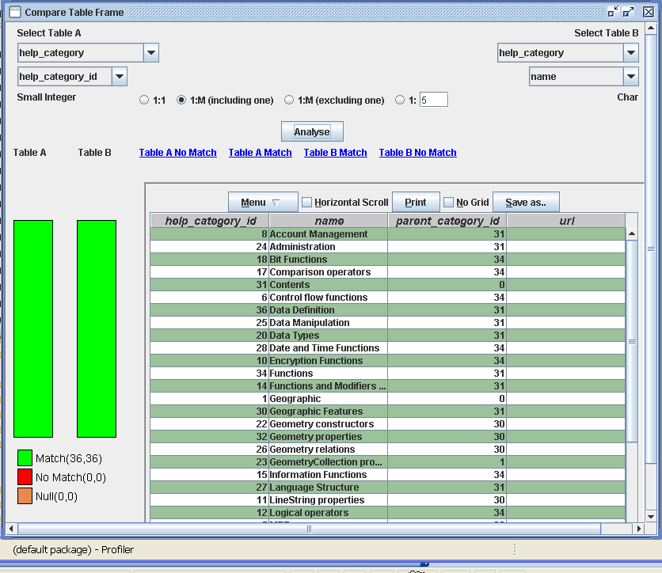

Cardinality Display Fig 13.0

__“Table Comparison” , “DB Comparison”  & “Schema Comparison”__ will open up connection dialog where user can choose any other DB. Its display tables and columns 
of new DB. User can map the tables and columns of new DB to present DB
and compare.
User can choose to display records that are a match or no-match by the
choosing the right radio button. Checkbox in “DB Comparison” dialog will 
allow user to choose the tables.

##  Information Pane

Selecting any table or column from MainFrame left panel will display a right window like following [Fig 14.0](#fig14). The scope of analysis is one table at a time and to go to “Analysis” panel a column of that table must be selected. Generally the focus of analysis is a column, but all columns can be viewed in editable mode and are editable from “Analysis” pane. The selected column will appear as first column just for ease. ( In tables with multiple columns, it will be difficult to find the chosen column for analysis)

“Information” pane has aggregate and primary information but for serious analysis and editable view of table “Analysis” panel should be used.

“Information” Pane will show total count of rows on top right corner. It will display 100 rows or less (if table has less than 100 rows). 
Like in the example below table ‘help_category’ has only 36 rows so all the rows are displayed.
If user wants to see more rows or want to put some conditions on table, click filter icon    .That is on second row of “Information Pane”. It will open up “Query Pane”. On top right corner there will be text input area. User can enter the number of rows, s/he wants to see. If filter produces less number of rows or table has less number of rows, it will automatically changed to total number of rows available.

Other options on second rows, next to Filter icons, are clickable link. That will provide metadata information about table – like Privilege, Index, Summary, and Metadata.

Central part of “Information” Pane is ReportTable that will display the table in non editable view.

<a name="fig14"/>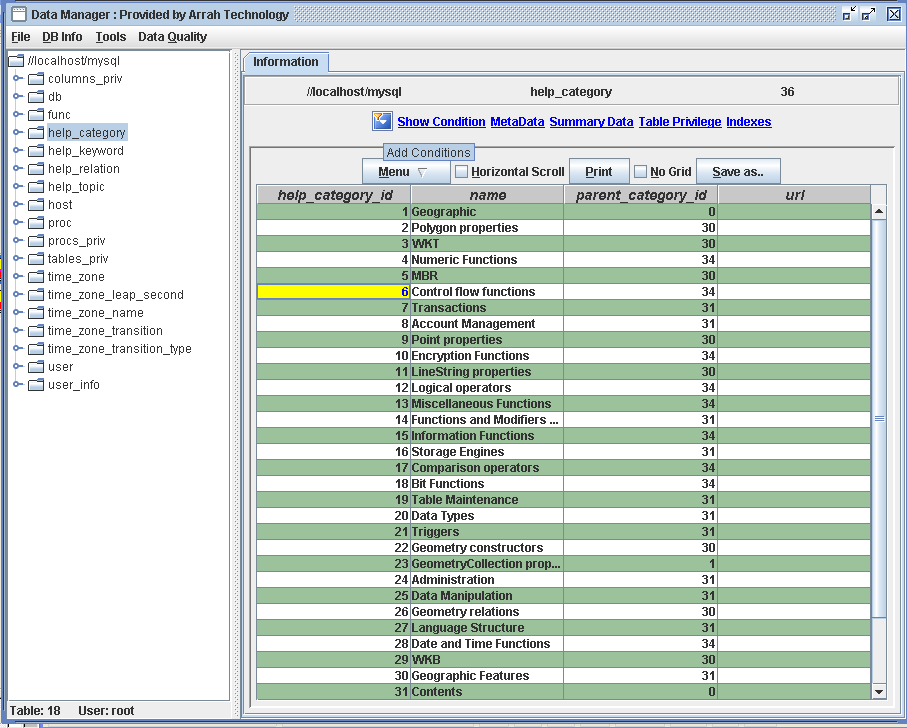

Table Selection View  Fig 14.0

Noteworthy is, for columns two tabbed pane appears “Information” and “Analysis” while for table only “Information” pane appears.

Right clicking on table or column from left tree panel will open a popup with options of 
“Super Table Info” will give information about this table’s super table.
“Relationship Table” will give information about primary key, foreign key, exported key 
“Relationship Image” will give information (in a pane like Table Model Pane) about parent table, their parent table till it goes to root tables. 
“Default Info” will give information about default values of the table’s column.

## Information panel for column
 
Column’s Information panel will look like below [Fig 15.0](#fig15). which will have a bar chart (Record Count) , a pie chart (Distribution Chart) and horizontal bar chart (Pattern Information) – if there is data to display chart.

“Record Count” will have information about “Total Count, Unique Count, Repeat Count (Total Count – Unique Count), Pattern Count (data appearing more than once) and Null Count”.

“Distribution Chart” will show the spread of data. The way to read the following Distribution Chart is :
There are 137 (number in parenthesis) data members whose value is below “86”. There are 109 (number in parenthesis) data members whose value is between “86” and “160”. There are 149 (number in parenthesis) data members whose value is between “160” and “242” and so on.

“Pattern Information” will show top 25 repeated (pattern) data values. The number value on left side of the chart (in blue color) shows the count of right hand data (actual data) is repeated. Length of bar chart is in proportion of the count – like data “30” is repeated 7 times, data “197” also 7 times.

If there are more than 25 patterns available for the column, it will be shown in “Other” as top pattern. In the following example it reads :
There are 116 other data members whose total pattern count is 370. So there are total 116+25 = 141 patterns. That can be verified from Pattern Count in Record Count.

“Min Value” and “Max Value” link will show top and bottom 20 values.
The complete “Information” pane for columns can be saved as image by clicking “Save Image” link.

<a name="fig15"/>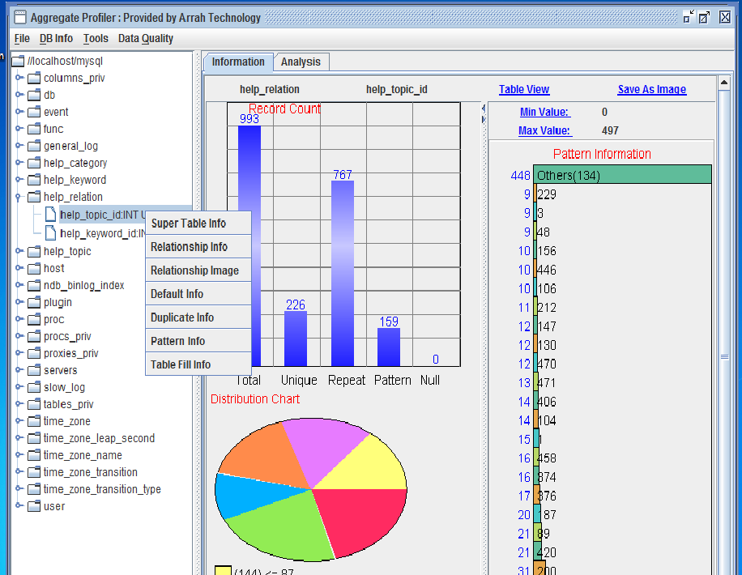

Column  Selection View  Fig 15.0

##  Analysis Pane

“Analysis” Pane can be used to do “String Analysis”, “Number Analysis”,
“String Length Analysis” and “Timeliness Analysis” with conditions. Opening table in edit mode will allow adding and deleting rows to table. 
If user set condition by clicking icon   , same condition will be carried over for analysis (String, Number, and Statistical) and Viewing record. If table or column selection is changed, condition will be reset to none. “Show Condition” link will show condition that is set for analysis or viewing table or column.
“Number Analysis” Pane will be displayed when use clicks “Number Analysis” link. It is user responsibility to choose a column which is Number type otherwise user will get error.

“Comment” button is used to enter comment for this analysis which will be saved, when user saves the Report by clicking “Save Report” button. Report will be saved in .atd format can be open by MainFrameFileOpen menu.
Report is saved as java serialized object. So if there is version mismatch of saving and open software (say you trying to open a report that has been created by older version) Open might give an error.
“Save Report” will save all 3 number analyses – Bin, Cluster and Number Profiler.

### __Analysis Pane > Binning__

Binning is profiling data by putting data into different continuous baskets. Bin Analysis is done to find out impact of different baskets on Business Behavior.

Example – if use is doing Bin analysis on Age column by creating basket 0-10,10-20,20-30,30-40,40-60,60-70,70-90,90-100.
Basket should be modified in such a way that output shows a pattern. Say number of records of 0-10 and 10-20 baskets are Zero then these two baskets can be merged into one of 0-20 as below 20 there is no record.
Tool tip will provide information about count, % count, and % cumulative.
Like in following example Bin 1 (you can change the name) is 0-19, Bin 2 is 19-100, Bin 3 is 100-0 but it will not be counted as 0 is less than 100.

<a name="fig16"/>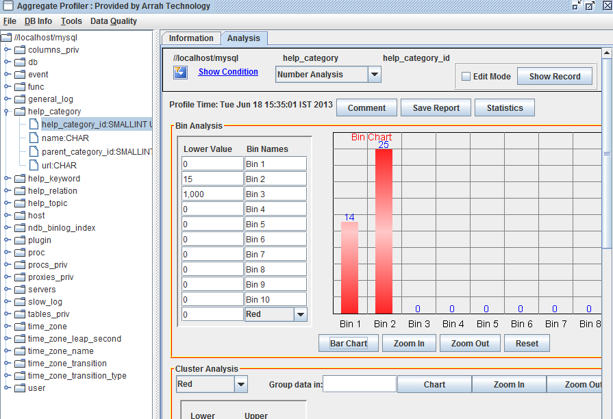

Bin Number Analysis Fig 16.0

### __Analysis Pane > Clustering__

Cluster analysis is used to see the where data is lying. This helps business in finding out the space where dataset is most likely to reside. If dataset is distributed equally it means there is no preference of space for data. If data is clustered at different spaces it will give intelligence to business what is the probability of data to be in the particular space.

The left slide bar is used to narrow down the dataset. By default it min and max of dataset values.  Like in following example, dataset lying between 6 and 34. If you want to look at dataset between 10 and 30 slide Upper knob to 30 and Lower knob to 10.
“Group data in:” textbox will take a positive integer. This number is user is group data together. Like in following example of group of 4 data will create a dataset that is present by tiny red dot. For all 36 data (36/4 = 9), 9 dataset is represent. Clicking on dataset, will give information about group avg., Number is group above, and groups below. Group ID will start from 1.

<a name="fig17"/>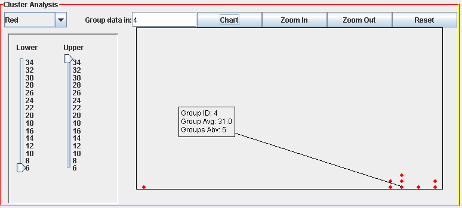

Cluster Number Analysis Fig 17.0

### __Analysis Pane > Number Profiler__

“Number Profiler” is used to take user input to do the aggregate profiling (Sum, Count, Minimum, Maximum and Average) for the range user chooses.
User can do aggregate profiling on complete column, or can choose an upper and lower limit or a range. This analysis is important to find out the location of dataset and which data matters most.
Tooltip will provide what % of data lies in which range. Like in following example 99.9% of total sum lies in range 20 -40. There might be a case where Count is less in range 20-40 but the value of data is higher so it Sum is high.

<a name="fig18"/>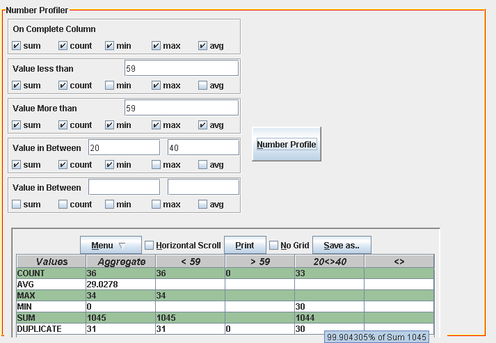

Number Profiler Fig 18.0

### __Analysis Pane > Statistical Analysis__

User can click “Statistics” button to so statistical analysis of the number.  Clicking “Statistics” button will open a window like [Fig 19.0](#fig19).  Top row will give information about data source, table, column, condition (filter) and profiling time.

FileSave will save the complete panel in .atd format and it can be open by MainFrameFileOpen. It is saved as java serialized object.

3 types of analysis will be shown in tabbed pane. “Frequency Analysis”, “Variation Analysis” and “Percentile Analysis”

<a name="fig19"/>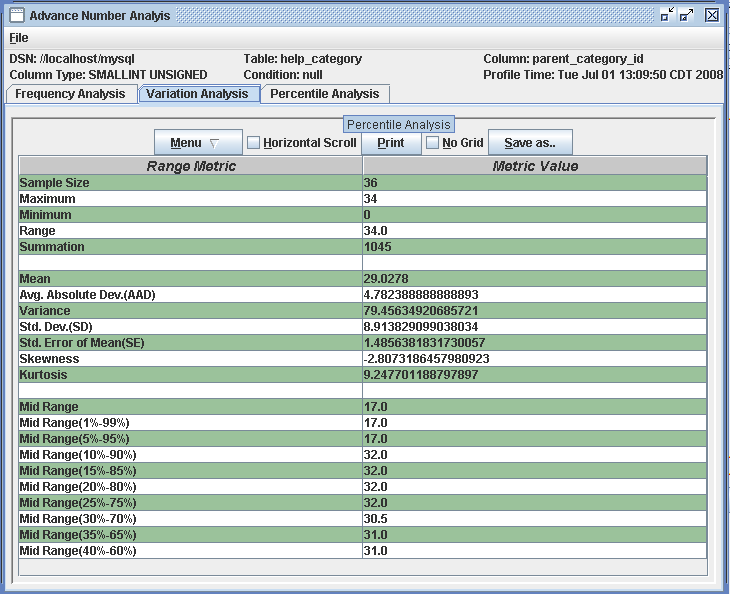

Statistical Analysis Fig 19.0

### __Analysis Pane > String Analysis__

“String Analysis” will open [Fig 20.0](#fig20) like pane inside “Analysis” pane. “Comment” and “Save Report” button do the same work as “Number Analysis” buttons but for “String Analysis” Pane.

“String Analysis” will allow 3 query to run simultaneous on any column. It can be match “Like”, “Not Like” and “Regex” (Regular Expression). If “Distinct” checkbox is clicked, only distinct values will be presented. Number in Parenthesis “(number)” will, how many time that data is repeated (only when Distinct is checked).

“Pattern_1 Count:” number will tell you how many records matched the criterion in “Pattern_1” label. Right Clicking on Label (“Pattern_1”) which is left to pattern input textbox, will open a popup menu. This menu is populated from file “popupmenu.txt”. User can add/edit this file to customize “String Analysis” popup menu.

<a name="fig20"/>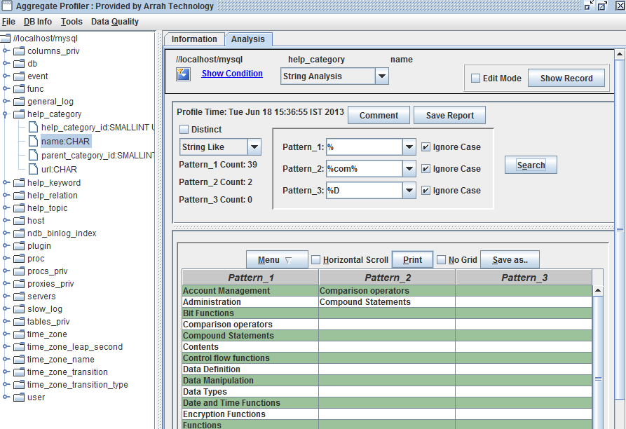

String  Analysis Fig 20.0

Numbers also can be analyzed like String, Like number 10.345 will be treated like String “10.345”

### __Analysis Pane > String Length Analysis__

String Length Analysis is used to finding out string length of the data and how many bytes are used. It will open a dialog like following [Fig 21.0](#fig21) Like Statistical analysis it has 3 panels – Frequency Analysis, Variation Analysis and Percentile Analysis. 

<a name="fig21"/>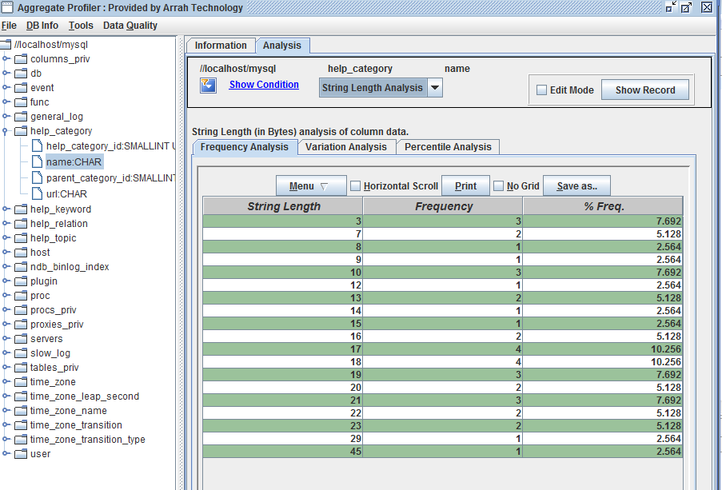

String Length Analysis Fig 21.0

### __Analysis Pane > Timeliness Analysis__

<a name="fig22"/>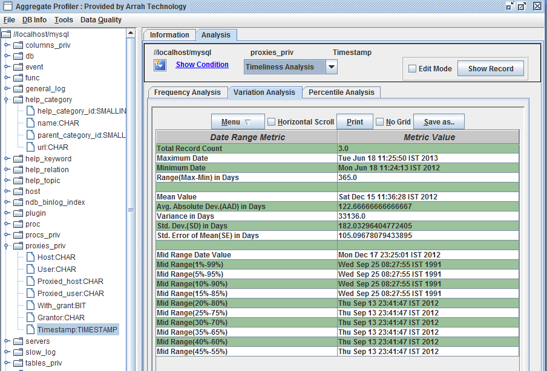

Timeliness Analysis Fig 22.0

### __Analysis Pane > Edit Mode Show Record__

Will allow user to add, edit and delete values if “Edit Mode” checkbox is selected otherwise user can only view record. . It is advisable that after adding or deleting rows user rerun “Edit Mode” “Show Record” button. Some database does not automatically update the values (refresh) after deleting or adding so clicking again Edit Mode “Show Record”  will fetch the latest values ( like refresh).

By Default 100 or less (if table has less number of records or condition (filter) produces less number of records) records per page will be shown. If user wants to see less or more, s/he can change the values of “Rows in a page” textbox and click “Update” button. The bottom “New Row” button is clicked to add new row.

<a name="fig23"/>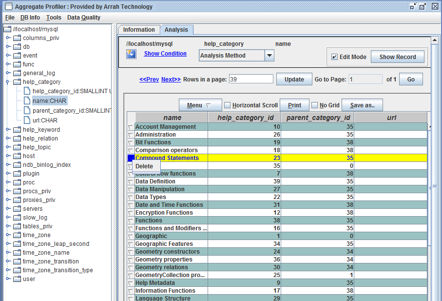

Edit Mode Show Record  Fig 23.0